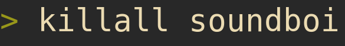

# soundboi

cross platform minimalistic soundboard that lives in your terminal

## features

Play sound samples from your CLI using one keystroke per sample.

* cross platform (TODO: have someone test with macOS)
* minimal (<100 lines of Rust)
* zero config
* supports mp3, wav and ogg samples

## installation

Right now, you need to build `soundboi` yourself.
You need to [install](https://www.rust-lang.org/learn/get-started) Rust
on your machine if you don't have already.

```
git clone https://github.com/wullewutz/soundboi
cd soundboi
cargo install --path .
```

To uninstall, run
```
cargo uninstall soundboi
```

## usage

Place all your sound samples in a folder.

First character of each filename will be used to trigger the sample when
pressed on the keyboard.
Therefore, first characters have to be unique for all files.
To achieve this you can (and should) prefix each file with the desired trigger
key followed by an underscore:

```
~/my_samples> ls
a_applause.wav	d_laser.wav  f_laughter.mp3  s_gunshot.wav
```
Now run soundboi inside this folder

```
cd ~/my_samples
soundboi
a: applause
d: laser
f: laughter
s: gunshot
```

You will get a map of the keys and samples and are ready to have fun with your
coworkers.

Simply press Ctrl-C to exit `soundboi`.
